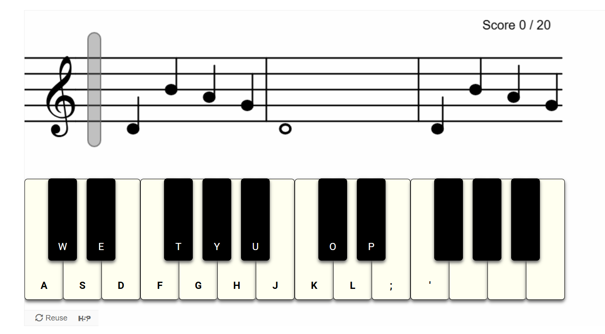

# H5P Piano Performance

A reusable [H5P Interactive](https://h5p.org/) for assessing a student's ability to play sheet music on a piano. A highly configurable guitar-hero style game that supports both keyboard input as well as mouse through on-screen keyboard.



## Try it out

After cloning, run the following commands to load the demo page:

```
npm i
npm run build
npm run demo
```

## Sheet Music Format

The format for sheet music input is a modified version of [ABC Notation](https://en.wikipedia.org/wiki/ABC_notation) composed of tokens delimited by spaces. Each token is of the following format: `<identifier>:<data>`. Both metadata as well as note data use this format. All metadata should precede all note data.

The possible metadata identifiers are:

- `T` - Time signature. Data is expected to be `a/b` where `a` is number of beats per measure and `b` is the duration of those beats. Example of 4:4 timing would be `T:4/4`
- `L` - Default note duration, expressed as a fraction of a whole note. The default note duration is assigned to all notes that do not have an explicit duration, making it faster to write the notation by hand and saves space. Example of a default note size of a quarter note would be `L:1/4`
- `O` - Default octave which will be assigned to all notes that do not have an explicit octave. An example for a piece that has the majority of its notes within the `C4-B4` range, a default octave of `O:4` would make it faster to write the notation.

Notes are represented in the following format: `P[#][O][:D]` where `P` represents the pitch, `#` represents a sharp note, `O` represents the octave and `D` represents the duration. Valid durations are quarter note (`1`), half note (`2`), whole note (`4`), eighth note (`8`). If octave or duration are not provided, the configured default will be assumed. The following are examples of valid notes:

- `C` - C in the default octave of the default duration
- `D#:2` - D# half note in the default octave
- `A6:8` - A6 eighth note
- `G#2:4` - G2 # whole note 
